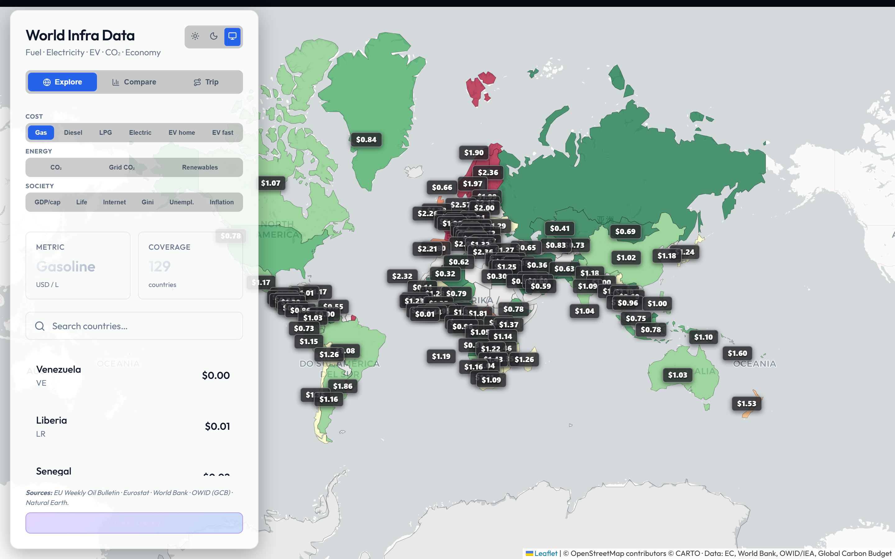
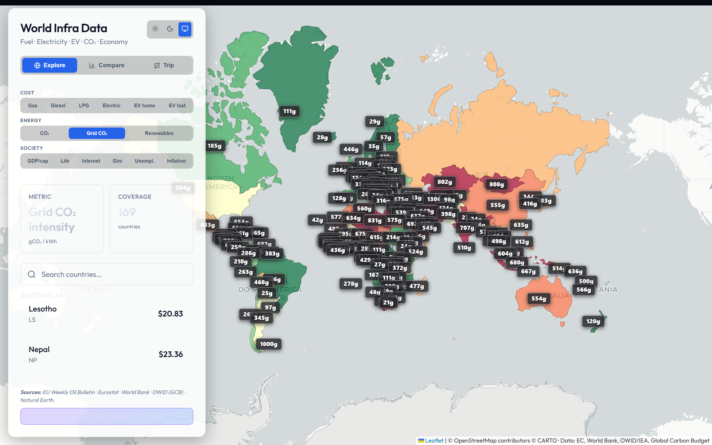
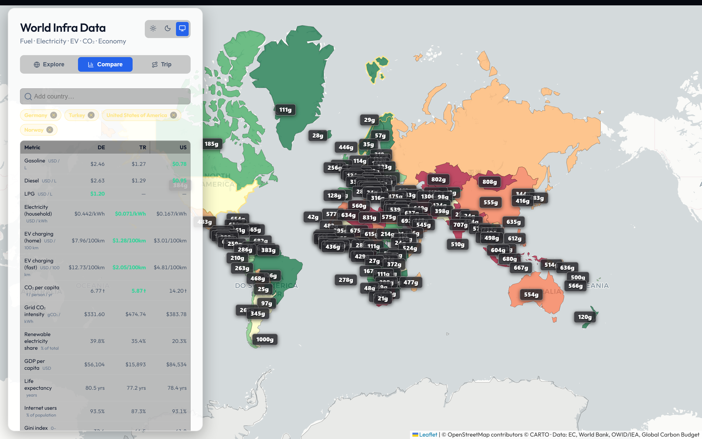
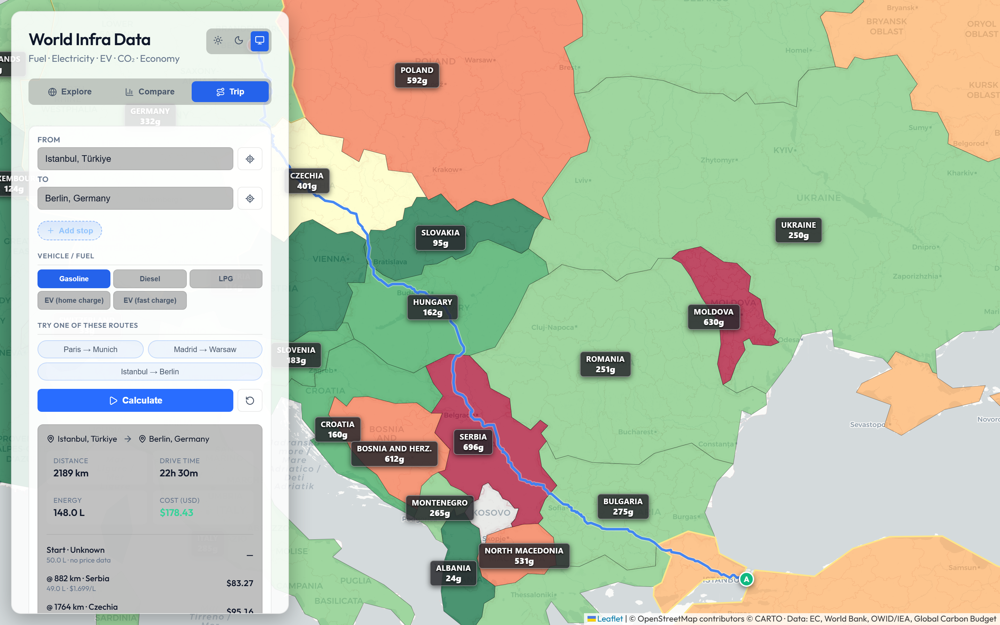
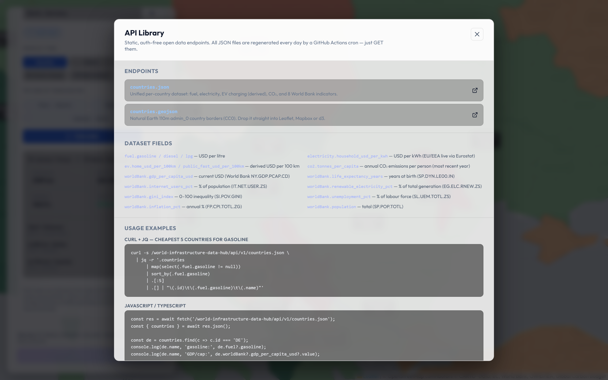

<div align="center">

# 🌍 World Infrastructure Data Hub

### One map, 15 metrics, 170 countries. Fuel, electricity, EV charging, CO₂ and 8 World Bank indicators — refreshed daily from open government data.

**[🌐 Live Demo](https://aykutsp.github.io/world-infrastructure-data-hub/)** · **[📖 API Reference](#-open-data-api)** · **[📦 Client Libraries](#-client-libraries)** · **[🐛 Report Bug](https://github.com/aykutsp/world-infrastructure-data-hub/issues/new?template=bug_report.yml)** · **[💡 Request Feature](https://github.com/aykutsp/world-infrastructure-data-hub/issues/new?template=feature_request.yml)**

<br />

[](https://github.com/aykutsp/world-infrastructure-data-hub/actions/workflows/deploy.yml)
[](https://github.com/aykutsp/world-infrastructure-data-hub/releases/latest)
[](./LICENSE)
[](https://github.com/aykutsp/world-infrastructure-data-hub/commits/main)
[](https://github.com/aykutsp/world-infrastructure-data-hub/issues)
[](https://github.com/aykutsp/world-infrastructure-data-hub/stargazers)

[](https://www.typescriptlang.org/)
[](https://react.dev/)
[](https://vite.dev/)
[](https://leafletjs.com/)
[](https://nodejs.org/)
[](./libraries/python)
[](./libraries/go)
[](./libraries/flutter)
[](./libraries/csharp)

[](#-metrics--sources)
[](#-metrics--sources)
[](#-metrics--sources)
[](./CONTRIBUTING.md)

</div>

---

An interactive world map for the real cost of *living* and *moving*: **retail fuel prices, household electricity prices, EV charging costs, CO₂ emissions and eight World Bank indicators** — all in one place, all from open government / inter-governmental sources, all refreshed on a daily cron.

## 📸 Screenshots

**Explore view — 15 metrics grouped into Cost / Energy / Society**



**Grid CO₂ intensity** — new in v1.1, the carbon intensity of each country's electricity mix in gCO₂ per kWh:



**Compare view** — pick up to 5 countries and stack every metric side-by-side, with the best cell per row highlighted:



**Trip calculator** — routing via OSRM, five vehicle/fuel modes, up to 8 waypoints, per-refuel receipt:



**API Library** — click the button at the bottom of the sidebar for the full endpoint reference and copy-paste snippets in curl, JavaScript, Python, Go and PHP:



## ✨ Features

- 🗺 **Unified choropleth world map** with 14 metrics grouped into **Cost**, **Energy** and **Society** tabs
- 🏷 **In-map country labels** with the selected metric shown per country, scaled to zoom
- 🆚 **Country Compare** — pick up to 5 countries and stack every metric side-by-side in a colour-coded table with "best" cells highlighted
- 🧭 **Trip calculator** — enter From / To (and up to 8 intermediate stops, or "current location"), pick your vehicle (**Gasoline, Diesel, LPG, EV home, EV fast**), hit Calculate. For fuel vehicles you get a real per-refuel receipt (tank topped up at 2 % reserve in whichever country you're in); for EVs you get a per-country electricity-cost breakdown with optional fast-charger markup.
- 🔌 **API Library modal** — one click away from copy-paste usage snippets in curl, JavaScript, Python, Go and PHP, plus a field reference for every key in the dataset.
- 📦 **Static open data endpoints** — `countries.json` (unified payload), `countries.geojson` (Natural Earth borders). Auth-free, rate-limit-free, refreshed daily.
- 🌓 Light / dark / system theme with matching CARTO tiles
- 🤖 **Self-updating** — a GitHub Actions cron job rebuilds and redeploys the site every morning

## 📊 Metrics & sources

| # | Metric | Group | Source | License |
|---|---|---|---|---|
| 1 | Gasoline (USD/L) | Cost | EU Weekly Oil Bulletin / World Bank Global Fuel Prices DB | CC BY 4.0 / ODbL |
| 2 | Diesel (USD/L) | Cost | same | same |
| 3 | LPG (USD/L) | Cost | same | same |
| 4 | Household electricity (USD/kWh) | Cost | **Eurostat nrg_pc_204 (live)** for EU/EEA, static fallback for rest | CC BY 4.0 |
| 5 | EV home charge (USD/100 km) | Cost | derived: electricity × 18 kWh/100 km | — |
| 6 | EV fast charge (USD/100 km) | Cost | derived: home × 1.6 fast-charger markup | — |
| 7 | CO₂ per capita (t/yr) | Energy | Our World in Data (Global Carbon Budget mirror) | CC BY 4.0 |
| 8 | Renewable electricity share (%) | Energy | World Bank EG.ELC.RNEW.ZS | CC BY 4.0 |
| 9 | GDP per capita (USD) | Society | World Bank NY.GDP.PCAP.CD | CC BY 4.0 |
| 10 | Life expectancy (years) | Society | World Bank SP.DYN.LE00.IN | CC BY 4.0 |
| 11 | Internet users (%) | Society | World Bank IT.NET.USER.ZS | CC BY 4.0 |
| 12 | Gini index | Society | World Bank SI.POV.GINI | CC BY 4.0 |
| 13 | Unemployment (%) | Society | World Bank SL.UEM.TOTL.ZS | CC BY 4.0 |
| 14 | Inflation (CPI, % yoy) | Society | World Bank FP.CPI.TOTL.ZG | CC BY 4.0 |
| — | Country borders | — | Natural Earth 110m admin_0 | CC0 |

All upstreams are fetched at build time by `scripts/generateData.js` and baked into `public/api/v1/countries.json`. The GitHub Actions workflow runs this daily, so the live site always reflects the most recent upstream numbers.

## 🛠 Tech Stack

| Layer | Choice |
|---|---|
| Framework | React 19 + Vite 8 |
| Language | TypeScript 5 |
| Mapping | Leaflet + react-leaflet (GeoJSON choropleth + Polyline routes) |
| Routing | OSRM public demo server |
| Geocoding | Nominatim (OpenStreetMap) |
| Data pipeline | Node.js + SheetJS (`xlsx`) |
| Hosting | GitHub Pages (via GitHub Actions) |

## ⚙️ Installation

```bash
git clone https://github.com/aykutsp/world-infrastructure-data-hub.git
cd world-infrastructure-data-hub
npm install
```

## 🚀 Usage

```bash
npm run generate-data   # pull every upstream feed once (~30 s)
npm run dev             # local dev server
npm run build           # prod: regenerate data + typecheck + bundle
npm run preview         # smoke-test the built output
```

## 🔌 Open Data API

Base URL: `https://aykutsp.github.io/world-infrastructure-data-hub/api/v1/`

| Endpoint | Description |
|---|---|
| [`countries.json`](https://aykutsp.github.io/world-infrastructure-data-hub/api/v1/countries.json) | Unified dataset — 14 metrics per country |
| [`countries.geojson`](https://aykutsp.github.io/world-infrastructure-data-hub/api/v1/countries.geojson) | Natural Earth borders (CC0) |

### Simplified JSON schema

```jsonc
{
  "lastUpdated": "2026-04-05T15:00:00.000Z",
  "sources": [ "EU Weekly Oil Bulletin — CC BY 4.0", "…" ],
  "coverage": { "fuel": 130, "electricity": 89, "ev": 89, "co2": 167, "worldBank": 167 },
  "countries": [
    {
      "id": "DE", "iso3": "DEU", "name": "Germany", "lat": 51.17, "lng": 10.45,
      "fuel":        { "gasoline": 2.46, "diesel": 2.64, "lpg": 1.20, "source": "EU Weekly Oil Bulletin" },
      "electricity": { "household_usd_per_kwh": 0.403, "year": 2025, "period": "2025-S1", "source": "Eurostat nrg_pc_204 …" },
      "ev":          { "home_usd_per_100km": 7.25, "public_fast_usd_per_100km": 11.60, "assumptions": {...} },
      "co2":         { "year": 2023, "tonnes_per_capita": 8.09, "total_million_tonnes": 673.22, "source": "OWID/GCB" },
      "worldBank": {
        "gdp_per_capita_usd":        { "value": 54290, "year": 2023, "source": "World Bank" },
        "life_expectancy_years":     { "value": 80.7,  "year": 2022, "source": "World Bank" },
        "internet_users_pct":        { "value": 91.8,  "year": 2023, "source": "World Bank" },
        "renewable_electricity_pct": { "value": 51.2,  "year": 2022, "source": "World Bank" },
        "gini_index":                { "value": 31.9,  "year": 2020, "source": "World Bank" },
        "unemployment_pct":          { "value": 3.1,   "year": 2024, "source": "World Bank" },
        "inflation_pct":             { "value": 5.9,   "year": 2023, "source": "World Bank" },
        "population":                { "value": 83300000, "year": 2023, "source": "World Bank" }
      }
    }
  ]
}
```

### Usage examples

**curl + jq** — top 10 cheapest gasoline markets:

```bash
curl -s https://aykutsp.github.io/world-infrastructure-data-hub/api/v1/countries.json \
  | jq -r '.countries
      | map(select(.fuel and .fuel.gasoline != null))
      | sort_by(.fuel.gasoline)
      | .[:10]
      | .[] | "\(.id)\t\(.fuel.gasoline)\t\(.name)"'
```

**JavaScript / TypeScript**:

```ts
const { countries } = await fetch(
  'https://aykutsp.github.io/world-infrastructure-data-hub/api/v1/countries.json'
).then((r) => r.json());

const de = countries.find((c: any) => c.id === 'DE');
console.log(`${de.name}: fuel $${de.fuel?.gasoline}/L, electricity $${de.electricity?.household_usd_per_kwh}/kWh, CO₂ ${de.co2?.tonnes_per_capita} t/cap`);
```

**Python**:

```python
import urllib.request, json

with urllib.request.urlopen("https://aykutsp.github.io/world-infrastructure-data-hub/api/v1/countries.json") as r:
    data = json.load(r)

# Top 10 countries by life expectancy
by_life = sorted(
    (c for c in data["countries"]
     if c["worldBank"] and c["worldBank"].get("life_expectancy_years")),
    key=lambda c: c["worldBank"]["life_expectancy_years"]["value"],
    reverse=True,
)
for c in by_life[:10]:
    v = c["worldBank"]["life_expectancy_years"]
    print(f"{c['id']}\t{v['value']:.1f} yrs ({v['year']})\t{c['name']}")
```

**Go, PHP, Rust, C#** — all work exactly the same way. Click the **API Library** button at the bottom of the live sidebar for ready-to-copy snippets.

## 📁 Project Structure

```
.
├── .github/workflows/deploy.yml     # Daily data refresh + GitHub Pages deploy
├── public/api/v1/                   # Generated dataset (built in CI)
├── scripts/generateData.js          # Unified pipeline (fuel + electricity + EV + CO2 + WB)
├── src/
│   ├── App.tsx
│   ├── components/
│   │   ├── Dashboard/
│   │   │   ├── Sidebar.tsx          # Explore / Compare / Trip views + API Library button
│   │   │   └── ApiLibraryModal.tsx  # Modal with API reference + snippets
│   │   ├── Map/InfraMap.tsx         # Choropleth + labels + route polyline
│   │   └── Trip/TripCalculator.tsx  # Multi-fuel + EV cost model
│   ├── types.ts                     # Country / Dataset / DatasetSpec / Trip types
│   ├── main.tsx
│   └── index.css
├── index.html
├── package.json
└── vite.config.ts
```

## 📌 Roadmap

- [ ] Live global electricity feed (replace static fallback for non-EU)
- [ ] CO₂ intensity of the local grid — so EV cost **and** EV CO₂ match the local mix
- [ ] Pre-computed trip API endpoints under `/api/v1/trips/*.json`
- [ ] Historical time-series per metric with sparklines
- [ ] Cost-parity view: at what electricity price does an EV break even vs gasoline in each country?
- [ ] Client libraries under `libraries/` (npm, PyPI, Go, Flutter, NuGet)
- [ ] Charging-station point-of-interest layer (OpenChargeMap)
- [ ] Water prices, air quality, mobile & broadband costs as future metrics

## 📦 Client Libraries

Language-specific wrappers live under [`libraries/`](./libraries/). All five expose the same surface (`getDataset`, `getCountry`, `rank`, `globalAverage`) and are ready to publish to their respective registries.

| Language | Package | Install | Source |
|---|---|---|---|
| JavaScript / TypeScript | `world-infra-data` (npm) | `npm install world-infra-data` | [`libraries/typescript`](./libraries/typescript) |
| Python 3.9+ | `world-infra-data` (PyPI) | `pip install world-infra-data` | [`libraries/python`](./libraries/python) |
| Go 1.21+ | `github.com/aykutsp/world-infrastructure-data-hub/libraries/go` | `go get github.com/aykutsp/world-infrastructure-data-hub/libraries/go@latest` | [`libraries/go`](./libraries/go) |
| Dart / Flutter | `world_infra_data` (pub.dev) | `dart pub add world_infra_data` | [`libraries/flutter`](./libraries/flutter) |
| .NET 8+ | `WorldInfraData` (NuGet) | `dotnet add package WorldInfraData` | [`libraries/csharp`](./libraries/csharp) |

## 📜 Changelog

**v1.1.0** — Grid CO₂ intensity (gCO₂/kWh) from OWID/Ember energy data as a 15th metric, 15-year historical time-series for CO₂ and the eight World Bank indicators, inline SVG sparklines next to every historical metric in the country detail panel, five official client libraries under `libraries/` (npm, PyPI, Go modules, Flutter, NuGet), optional OpenChargeMap charging-station count loader (activates automatically when `OPENCHARGEMAP_KEY` is set in the CI environment).

**v1.0.0** — Live Eurostat electricity pull, Country Compare view (up to 5 countries side-by-side), ported Trip Calculator with 5 cost modes (gasoline / diesel / LPG / EV home / EV fast) and up to 8 waypoints, API Library modal with copy-paste snippets, 8 new World Bank indicators (GDP per capita, population, life expectancy, internet users, renewable share, Gini, unemployment, inflation).

**v0.1.0** — Initial scaffold with fuel + electricity (static) + EV (derived) + CO₂.

## 🤝 Contributing

See [`CONTRIBUTING.md`](./CONTRIBUTING.md). Community health docs: [`SECURITY.md`](./SECURITY.md), [`CODE_OF_CONDUCT.md`](./CODE_OF_CONDUCT.md).

## 📄 License

MIT. See [`LICENSE`](./LICENSE).

Feel free to use this project however you like — fork it, ship it, tear it apart, build something bigger on top of it. If you end up using it in something public, a small credit or a link back would make my day, but it's not a requirement. Thanks for taking a look.

Upstream datasets keep their original licences — see the data sources table above.
