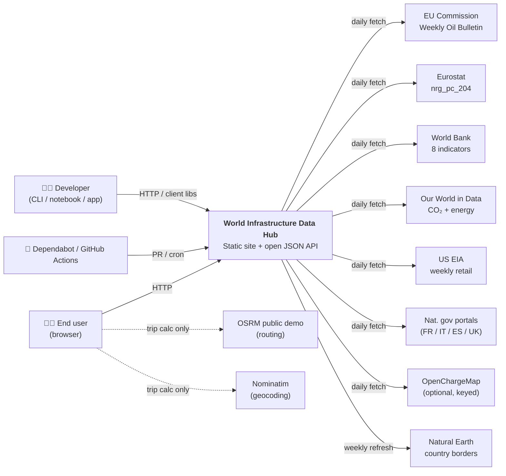
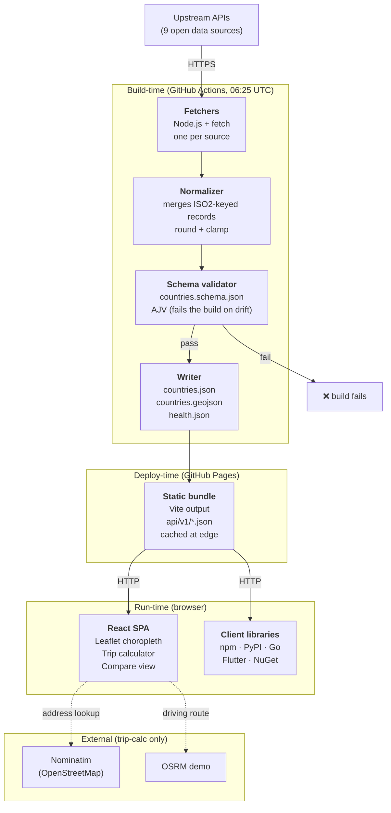

# System overview

C4-model diagrams for the World Infrastructure Data Hub. Two levels of zoom — system context and containers. Component-level internals live in the source code itself and in the relevant ADRs.

## Level 1 — system context

Who uses the system, and what does it touch?

## Level 2 — containers

What moving parts make up "The System"?

## Notable things the diagrams hint at but don't spell out

- **Raw responses are archived** before normalization, so a bug in the normalizer can be fixed and replayed against yesterday's upstream snapshot without re-hitting the APIs. (ADR-0004.)
- **The schema validator is a gate, not a suggestion.** If `countries.json` ever drifts from `schemas/countries.schema.json`, the build fails and the live site stays on the last known good dataset. (ADR-0007.)
- **Nominatim and OSRM are only called from the browser.** The build never geocodes anything server-side, which is why the static site is truly static and why every library consumer can reuse exactly the same endpoints without any dynamic dependency. (ADR-0003.)
- **Paid upgrade paths exist** for every external dependency. They're documented in [`docs/paid-upgrades.md`](../paid-upgrades.md) so that a team with a budget knows exactly which knob to turn to move from "open data, daily" to "licensed feed, minute-level".
